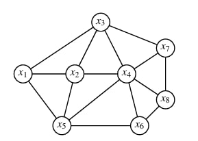

# Лабораторная работа №3
## Принятие решения по оптимизации размещения узла доступа на сети связи района

**Дисциплина:** Оптимизация и математические методы принятия решений  
**Вариант:** №9

---

## Цель работы

Изучить варианты постановки задач размещения объектов связи, освоить применение критериев оптимальности, решить задачу размещения узла радиодоступа с точки зрения оптимизации расстояний до самых удаленных населенных пунктов, решить задачу размещения узла проводного (кабельного) доступа с точки зрения оптимизации строительства линейных сооружений.

---

## Исходные данные (Вариант №9)

### Схема графа сети населенных пунктов

Граф содержит 8 вершин (населенных пунктов) согласно рис. 3.2(а) лабораторного практикума (для нечетных вариантов).

**Рис. 3.2. Граф сети населенных пунктов: (а) нечетные варианты (1, 3, ...); (б) четные варианты (2, 4, ...)**

### Количество абонентов в населенных пунктах (веса узлов графа)

Согласно табл. 3.2 для варианта №9 (в порядке $x_1, x_2, x_3, x_4, x_5, x_6, x_7, x_8$):

| Вершина | $x_1$ | $x_2$ | $x_3$ | $x_4$ | $x_5$ | $x_6$ | $x_7$ | $x_8$ |
|---------|------|------|------|------|------|------|------|------|
| Вес $p_i$ | 140 | 70 | 50 | 130 | 60 | 70 | 90 | 80 |

### Прямые соединения между населенными пунктами

| № | Ребро |
|---|-------|
| 1 | 1-2 |
| 2 | 1-3 |
| 3 | 1-5 |
| 4 | 2-3 |
| 5 | 2-4 |
| 6 | 2-5 |
| 7 | 3-4 |
| 8 | 3-7 |
| 9 | 4-5 |
| 10 | 4-6 |
| 11 | 4-7 |
| 12 | 4-8 |
| 13 | 5-6 |
| 14 | 6-8 |
| 15 | 7-8 |

### Расстояния между населенными пунктами (длины ребер графа)

Расстояния назначены самостоятельно из диапазона 3–15 км согласно указанию в лабораторном практикуме:

| Ребро | Расстояние, км |
|-------|----------------|
| 1-2 | 5 |
| 1-3 | 7 |
| 1-5 | 9 |
| 2-3 | 4 |
| 2-4 | 6 |
| 2-5 | 8 |
| 3-4 | 5 |
| 3-7 | 6 |
| 4-5 | 7 |
| 4-6 | 5 |
| 4-7 | 8 |
| 4-8 | 9 |
| 5-6 | 4 |
| 6-8 | 6 |
| 7-8 | 5 |

---

## Постановка задачи

Дана сеть — граф с $n$ вершинами $x_i$ $(i = 1, \dots, n)$, которым сопоставлены веса $p_1, p_2, \dots, p_n$. Необходимо найти точку $U$ — вершину графа на сети — такую, чтобы она соответствовала оптимальному значению целевой функции.

### 1. Для узлов радиодоступа (минимаксная задача)

Целевая функция: минимизация максимального расстояния до наиболее удаленного объекта

$$
F_i = \max_{j=1}^{n} (d_{ij}) \to \min = \min_{i} \left[ \max_{j=1}^{n} (d_{ij}) \right]
$$

### 2. Для проводных или кабельных узлов доступа (минисуммная задача)

Целевая функция: минимизация суммы всех расстояний с учетом количества абонентов

$$
F_i = \sum_{j=1}^{n} (d_{ij} \cdot p_j) \to \min = \min_{i} \left[ \sum_{j=1}^{n} (d_{ij} \cdot p_j) \right]
$$

где $d_{ij}$ — расстояние от $i$-й вершины до $j$-й вершины, $p_j$ — количество абонентов (вес) в $j$-й вершине.

---

## Ход выполнения работы

### 1. Построение матрицы кратчайших расстояний

Используя алгоритм поиска кратчайших путей на графе, найдем кратчайшие расстояния между всеми парами вершин.

**Матрица кратчайших расстояний $d_{ij}$ (км):**

|      | 1 | 2 | 3 | 4 | 5 | 6 | 7 | 8 |
|------|---|---|---|---|---|---|---|---|
| **1** | 0 | 5 | 7 | 9 | 13 | 14 | 13 | 18 |
| **2** | 5 | 0 | 4 | 6 | 8 | 11 | 10 | 15 |
| **3** | 7 | 4 | 0 | 5 | 12 | 10 | 6 | 11 |
| **4** | 9 | 6 | 5 | 0 | 7 | 5 | 8 | 9 |
| **5** | 13 | 8 | 12 | 7 | 0 | 4 | 15 | 10 |
| **6** | 14 | 11 | 10 | 5 | 4 | 0 | 11 | 6 |
| **7** | 13 | 10 | 6 | 8 | 15 | 11 | 0 | 5 |
| **8** | 18 | 15 | 11 | 9 | 10 | 6 | 5 | 0 |

### 2. Решение минимаксной задачи (для радиосети)

Для каждой вершины определяем максимальное расстояние до любой другой вершины:

| Вершина | $\max\limits_{j} d_{ij}$, км |
|---------|------------------------------|
| $x_1$ | 18 |
| $x_2$ | 15 |
| $x_3$ | 12 |
| $x_4$ | 9 |
| $x_5$ | 15 |
| $x_6$ | 14 |
| $x_7$ | 15 |
| $x_8$ | 18 |

Находим минимум среди этих максимальных расстояний:

$$
\min_{i} \left[ \max_{j} (d_{ij}) \right] = 9 \text{ км}
$$

Минимум достигается в вершине $x_4$.

**Результат:** Узел радиодоступа оптимально разместить в **вершине 4**.

### 3. Решение минисуммной задачи (для кабельной сети)

Рассчитываем взвешенную сумму расстояний для каждой вершины по формуле $F_i = \sum_{j=1}^{8} d_{ij} \cdot p_j$:

**Для вершины $x_1$:**

$$
\begin{aligned}
F_1 &= 0\cdot140 + 5\cdot70 + 7\cdot50 + 9\cdot130 + 13\cdot60 + 14\cdot70 + 13\cdot90 + 18\cdot80 \\
&= 0 + 350 + 350 + 1170 + 780 + 980 + 1170 + 1440 = \textbf{6240}
\end{aligned}
$$

**Для вершины $x_2$:**

$$
\begin{aligned}
F_2 &= 5\cdot140 + 0\cdot70 + 4\cdot50 + 6\cdot130 + 8\cdot60 + 11\cdot70 + 10\cdot90 + 15\cdot80 \\
&= 700 + 0 + 200 + 780 + 480 + 770 + 900 + 1200 = \textbf{5030}
\end{aligned}
$$

**Для вершины $x_3$:**

$$
\begin{aligned}
F_3 &= 7\cdot140 + 4\cdot70 + 0\cdot50 + 5\cdot130 + 12\cdot60 + 10\cdot70 + 6\cdot90 + 11\cdot80 \\
&= 980 + 280 + 0 + 650 + 720 + 700 + 540 + 880 = \textbf{4750}
\end{aligned}
$$

**Для вершины $x_4$:**

$$
\begin{aligned}
F_4 &= 9\cdot140 + 6\cdot70 + 5\cdot50 + 0\cdot130 + 7\cdot60 + 5\cdot70 + 8\cdot90 + 9\cdot80 \\
&= 1260 + 420 + 250 + 0 + 420 + 350 + 720 + 720 = \textbf{4140}
\end{aligned}
$$

**Для вершины $x_5$:**

$$
\begin{aligned}
F_5 &= 13\cdot140 + 8\cdot70 + 12\cdot50 + 7\cdot130 + 0\cdot60 + 4\cdot70 + 15\cdot90 + 10\cdot80 \\
&= 1820 + 560 + 600 + 910 + 0 + 280 + 1350 + 800 = \textbf{6320}
\end{aligned}
$$

**Для вершины $x_6$:**

$$
\begin{aligned}
F_6 &= 14\cdot140 + 11\cdot70 + 10\cdot50 + 5\cdot130 + 4\cdot60 + 0\cdot70 + 11\cdot90 + 6\cdot80 \\
&= 1960 + 770 + 500 + 650 + 240 + 0 + 990 + 480 = \textbf{5590}
\end{aligned}
$$

**Для вершины $x_7$:**

$$
\begin{aligned}
F_7 &= 13\cdot140 + 10\cdot70 + 6\cdot50 + 8\cdot130 + 15\cdot60 + 11\cdot70 + 0\cdot90 + 5\cdot80 \\
&= 1820 + 700 + 300 + 1040 + 900 + 770 + 0 + 400 = \textbf{5930}
\end{aligned}
$$

**Для вершины $x_8$:**

$$
\begin{aligned}
F_8 &= 18\cdot140 + 15\cdot70 + 11\cdot50 + 9\cdot130 + 10\cdot60 + 6\cdot70 + 5\cdot90 + 0\cdot80 \\
&= 2520 + 1050 + 550 + 1170 + 600 + 420 + 450 + 0 = \textbf{6760}
\end{aligned}
$$

### Сводная таблица результатов минисуммной задачи

| Вершина | $F_i$ |
|---------|-------|
| $x_1$ | 6240 |
| $x_2$ | 5030 |
| $x_3$ | 4750 |
| $x_4$ | **4140** |
| $x_5$ | 6320 |
| $x_6$ | 5590 |
| $x_7$ | 5930 |
| $x_8$ | 6760 |

Находим минимальное значение:

$$
\min_{i} F_i = 4140
$$

Минимум достигается в вершине $x_4$.

**Результат:** Узел проводной/кабельной сети оптимально разместить в **вершине 4**.

---

## Анализ полученных результатов

### Сравнение решений

| Задача | Критерий | Оптимальная вершина | Значение целевой функции |
|--------|----------|---------------------|--------------------------|
| Радиосеть (минимаксная) | $\min\limits_{i} \left[ \max\limits_{j} (d_{ij}) \right]$ | $x_4$ | 9 км |
| Кабельная сеть (минисуммная) | $\min\limits_{i} \left[ \sum\limits_{j=1}^{n} (d_{ij} \cdot p_j) \right]$ | $x_4$ | 4140 |

### Выводы

1. **Для радиосети** оптимальным местом размещения узла доступа является **вершина 4**, так как она обеспечивает минимальное максимальное расстояние до самого удаленного населенного пункта — 9 км. Это позволяет обеспечить качественную радиосвязь с наименьшими потерями сигнала для самых удаленных абонентов.

2. **Для проводной/кабельной сети** оптимальным местом размещения узла доступа также является **вершина 4** с минимальной взвешенной суммой расстояний 4140. Учет количества абонентов (весов вершин) показывает, что размещение в вершине 4 минимизирует общие затраты на строительство линейных сооружений.

3. **Особенность решения:** В данном варианте обе задачи дали одинаковое оптимальное решение (вершина 4). Это означает, что вершина 4 является одновременно и центром графа (для минимаксной задачи), и медианой графа (для минисуммной задачи).

4. **Практическая значимость:** Полученные результаты могут быть использованы при планировании сети связи района для минимизации затрат на строительство и обеспечения качества обслуживания абонентов.

---

## Ответ

| Тип сети | Оптимальная вершина для размещения узла доступа | Значение целевой функции |
|----------|--------------------------------------------------|---------------------------|
| Радиосеть (беспроводной доступ) | **Вершина 4** | 9 км |
| Проводная/кабельная сеть | **Вершина 4** | 4140 |

---

## Контрольные вопросы

### 1. Сформулируйте типовую задачу линейного программирования.

Типовая задача линейного программирования — это задача нахождения экстремума (максимума или минимума) линейной целевой функции при системе линейных ограничений (равенств или неравенств) и условиях неотрицательности переменных.

### 2. Что такое центр графа?

Центр графа — это вершина, для которой максимальное расстояние до любой другой вершины графа минимально:

$$
\text{Центр} = \arg \min_{i} \left[ \max_{j} d_{ij} \right]
$$

Центр используется при решении минимаксных задач (размещение узлов радиодоступа, пунктов экстренных служб).

### 3. Что такое медиана графа?

Медиана графа — это вершина, для которой сумма взвешенных расстояний до всех остальных вершин минимальна:

$$
\text{Медиана} = \arg \min_{i} \left[ \sum_{j=1}^{n} d_{ij} \cdot p_j \right]
$$

Медиана используется при решении минисуммных задач (размещение кабельных узлов, складов, сортировочных центров).

### 4. В чем отличие минимаксной задачи от минисуммной?

| Характеристика | Минимаксная задача | Минисуммная задача |
|----------------|-------------------|-------------------|
| Целевая функция | $\min\limits_{i} \left[ \max\limits_{j} (d_{ij}) \right]$ | $\min\limits_{i} \left[ \sum\limits_{j=1}^{n} (d_{ij} \cdot p_j) \right]$ |
| Что оптимизируется | Максимальное расстояние до объектов | Сумма расстояний с учетом весов |
| Тип решаемой вершины | Центр графа | Медиана графа |
| Пример применения | Радиосети, службы экстренной помощи | Кабельные сети, склады, почтовые отделения |

---
